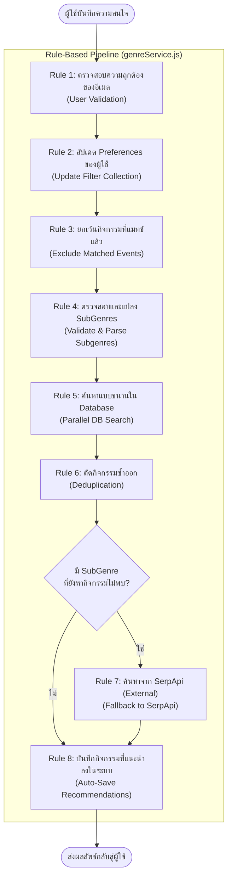
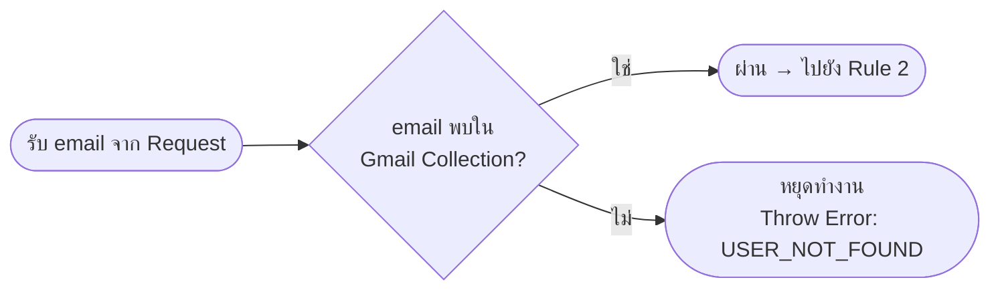
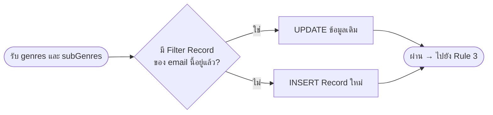
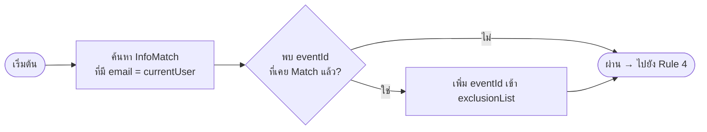
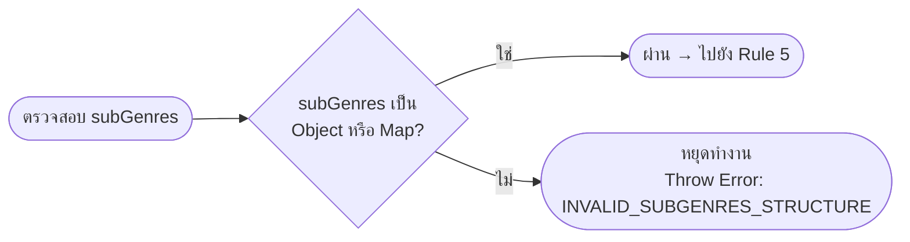
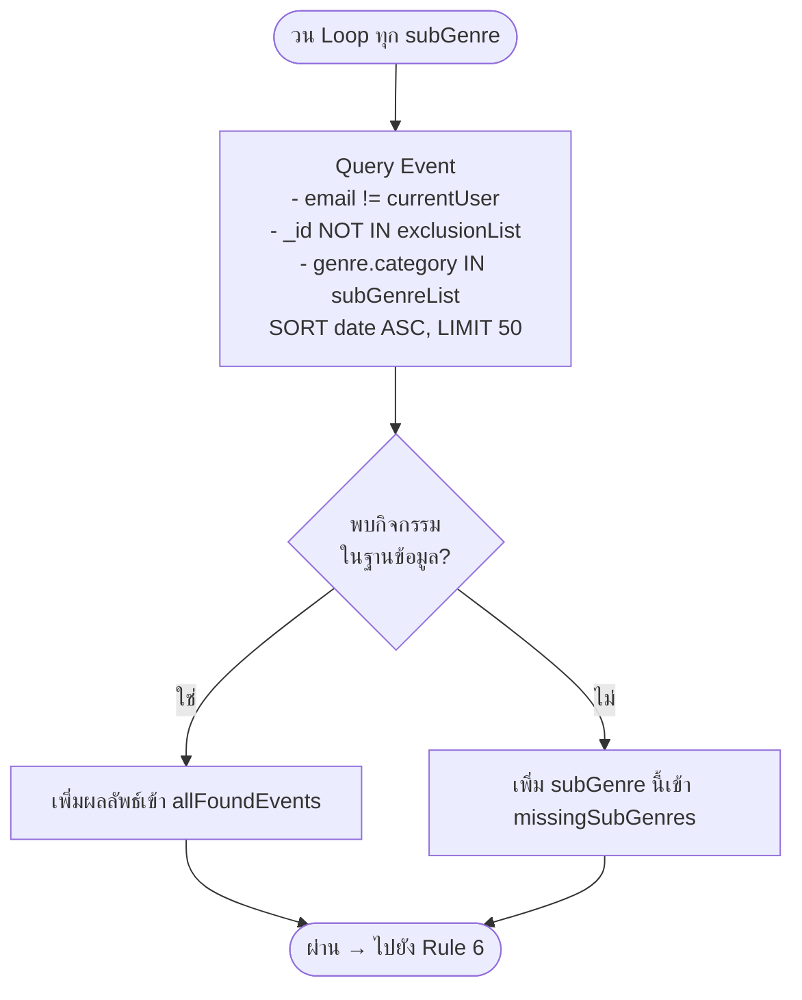
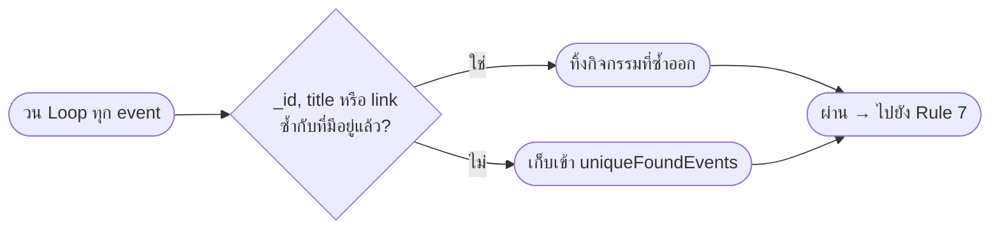
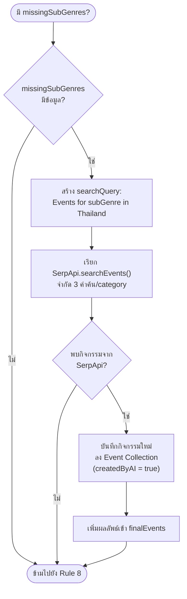
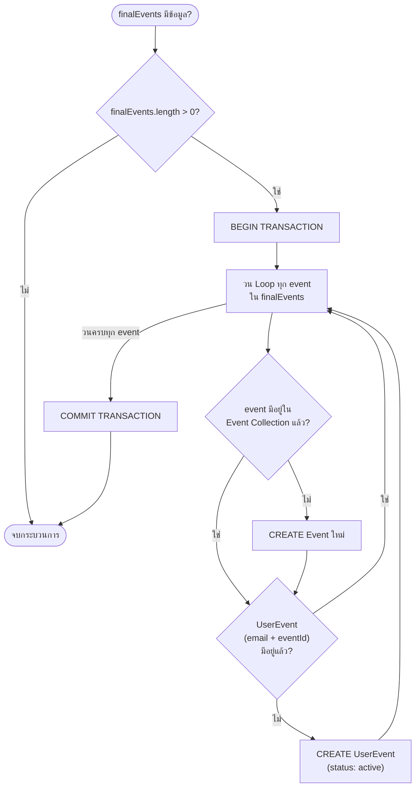

# การออกแบบระบบโดยใช้ Rule-Based System

## ภาพรวม

โปรเจกต์นี้นำหลักการ **Rule-Based System** มาใช้เป็นกลไกหลักในการแนะนำกิจกรรม (Event Recommendation) และการจับคู่ผู้ใช้งาน (User Matching) โดยออกแบบระบบให้ตัดสินใจและดำเนินการตามชุดกฎ (Rules) ที่กำหนดไว้อย่างชัดเจน ซึ่งทำงานเป็นขั้นตอนตามลำดับ (Sequential Pipeline) แทนการใช้โมเดล Machine Learning โดยตรง

---

## Rule-Based Pipeline: การค้นหาและแนะนำกิจกรรม

เมื่อผู้ใช้งานบันทึกความสนใจ (Genres/SubGenres) ระบบจะผ่านกระบวนการ Rule-Based ทั้งหมด **8 ขั้นตอน** ดังแผนภาพด้านล่าง

---

## รายละเอียดแต่ละกฎ (Rule Definition)

### Rule 1: ตรวจสอบสิทธิ์ผู้ใช้งาน (User Validation Rule)

> **เงื่อนไข (Condition):** ผู้ใช้งานต้องมีบัญชีอยู่จริงในระบบ
> **การกระทำ (Action):** หากไม่พบอีเมลใน Collection `Gmail` ระบบจะหยุดทำงานทันทีและโยน Error `USER_NOT_FOUND`

---

### Rule 2: อัปเดตความสนใจของผู้ใช้ (Preference Update Rule)

> **เงื่อนไข (Condition):** ผู้ใช้งานส่ง Genres และ SubGenres มาใหม่
> **การกระทำ (Action):** ระบบบันทึกทับข้อมูลเดิมใน Collection `Filter` หรือสร้างใหม่หากยังไม่มี (Upsert)

---

### Rule 3: คัดกรองกิจกรรมที่ผ่านการจับคู่แล้ว (Already-Matched Exclusion Rule)

> **เงื่อนไข (Condition):** กิจกรรมใดที่ผู้ใช้คนนี้เคยเข้าสู่กระบวนการ Match ไปแล้ว
> **การกระทำ (Action):** นำ `eventId` เหล่านั้นมาเก็บไว้ใน Exclusion List เพื่อไม่ให้แสดงซ้ำ

---

### Rule 4: ตรวจสอบโครงสร้าง SubGenres (SubGenres Structure Rule)

> **เงื่อนไข (Condition):** ข้อมูล SubGenres ต้องมีรูปแบบที่ถูกต้อง (Object หรือ Map)
> **การกระทำ (Action):** หากรูปแบบผิด ระบบหยุดทันทีและโยน Error `INVALID_SUBGENRES_STRUCTURE`

---

### Rule 5: ค้นหากิจกรรมใน Database (Database Search Rule)

> **เงื่อนไข (Condition):** สำหรับแต่ละ SubGenre ที่ผู้ใช้เลือก
> **การกระทำ (Action):** ค้นหากิจกรรมที่ตรงกับ Genre นั้นใน Database พร้อมกัน (Parallel) โดยยกเว้นกิจกรรมของตัวเองและกิจกรรมที่ถูก Exclude ไปแล้ว จำกัดผลลัพธ์ 50 รายการ เรียงตามวันที่

---

### Rule 6: ตัดข้อมูลซ้ำ (Deduplication Rule)

> **เงื่อนไข (Condition):** ผลลัพธ์จากการค้นหาหลาย SubGenre อาจมีกิจกรรมซ้ำกัน
> **การกระทำ (Action):** ใช้ `Map` เพื่อเก็บ `_id` ที่ไม่ซ้ำ และตรวจสอบซ้ำเพิ่มเติมด้วย `title` และ `link`

---

### Rule 7: Fallback ไปยัง SerpApi (External Search Fallback Rule)

> **เงื่อนไข (Condition):** SubGenre ใดที่ค้นหาใน Database ไม่พบกิจกรรมเลย (missingSubGenres)
> **การกระทำ (Action):** ส่งคำสั่งค้นหาไปยัง SerpApi โดยจำกัด 3 คำค้นต่อ Category เพื่อป้องกัน Rate Limit จากนั้นบันทึกผลลัพธ์ที่ได้กลับเข้า Database อัตโนมัติ

---

### Rule 8: บันทึกกิจกรรมแนะนำอัตโนมัติ (Auto-Save Recommendation Rule)

> **เงื่อนไข (Condition):** มีกิจกรรมที่ผ่านการกรองแล้วอยู่ในรายการผลลัพธ์
> **การกระทำ (Action):** บันทึก (`saveEventsFromSource`) แบบ Transaction เพื่อความปลอดภัยของข้อมูล โดยระบบจะสร้าง `Event` template ก่อน แล้วจึงผูกการเข้าถึงไว้กับผู้ใช้งานแต่ละคนในตาราง `UserEvent`

---

## สรุปภาพรวม Rule-Based Design

| ลำดับ | ชื่อกฎ               | Condition (เงื่อนไข)  | Action (การดำเนินการ)           |
| :---: | :------------------- | :-------------------- | :------------------------------ |
|   1   | User Validation      | ไม่พบอีเมลในระบบ      | หยุดทำงาน / ส่ง Error           |
|   2   | Preference Update    | ส่ง Genres มาใหม่     | อัปเดต / สร้าง Filter Record    |
|   3   | Exclude Matched      | กิจกรรมเคย Match แล้ว | เพิ่ม eventId เข้า Exclude List |
|   4   | SubGenres Validation | โครงสร้างผิดรูปแบบ    | หยุดทำงาน / ส่ง Error           |
|   5   | DB Search            | มี SubGenres ที่เลือก | ค้นหากิจกรรมใน Database แบบขนาน |
|   6   | Deduplication        | พบกิจกรรมซ้ำ          | ตัดรายการซ้ำออก                 |
|   7   | SerpApi Fallback     | ไม่พบกิจกรรมใน DB     | เรียก SerpApi และบันทึกผลลัพธ์  |
|   8   | Auto-Save            | มีกิจกรรมในผลลัพธ์    | บันทึกลง Event และ UserEvent    |
