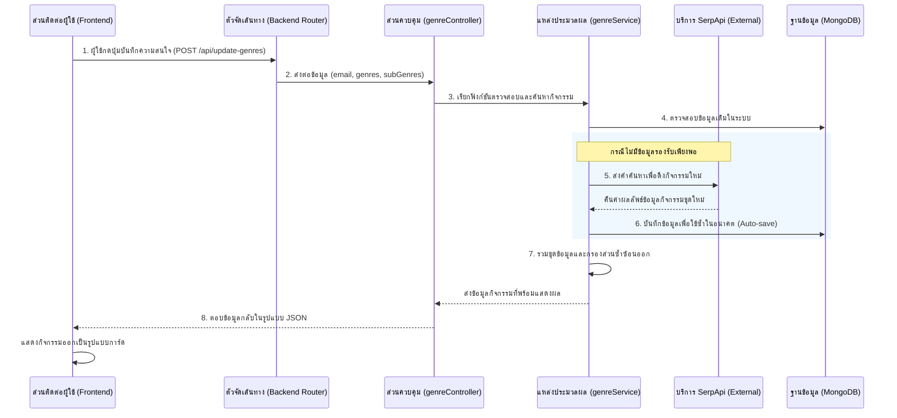

**การอธิบายกระบวนการดึงข้อมูลกิจกรรมแบบครบวงจร (End-to-End Flow: Frontend to SerpApi)**

เพื่อให้เห็นภาพรวมการทำงานของระบบในการค้นหาและดึงข้อมูลกิจกรรมตั้งแต่ส่วนแสดงผล (Frontend) ไปจนถึงการรับข้อมูลจาก SerpApi (Backend) ทางผู้จัดทำได้ออกแบบสถาปัตยกรรมระบบให้มีการทำงานประสานกันอย่างเป็นลำดับขั้นตอน โดยสามารถแบ่งการทำงานออกเป็น 4 ส่วนหลักตามแผนภาพการทำงาน (Flowchart) ดังต่อไปนี้

**ภาพที่ 3.X แผนภาพแสดงกระบวนการดึงข้อมูลกิจกรรม (Event Data Fetching Flow)**



และมีรายละเอียดการทำงานเชิงลึกพร้อมชุดคำสั่ง (Source Code) ในแต่ละขั้นตอนดังต่อไปนี้:

---

**ส่วนที่ 1: การรับคำสั่งจากผู้ใช้งาน (Frontend - User Action)**
_(อ้างอิงไฟล์ `frontend/src/home/cardmatch/AccordionList.jsx` บรรทัดแถวๆ 178-185)_

```javascript
setWaiting(true);
saveMutation.mutate({
  email,
  genres: Object.keys(subGenresObj),
  subGenres: subGenresObj,
  updatedAt: new Date().toISOString(),
});
```

**คำอธิบาย:** กระบวนการเริ่มต้นที่หน้าเว็บไซต์ เมื่อผู้ใช้งานเลือกหมวดหมู่ที่ตนเองสนใจเสร็จสิ้นและกดปุ่ม "ค้นหากิจกรรม" ระบบหน้าบ้าน (React) จะเปลี่ยนสถานะหน้าจอเป็น `setWaiting(true)` (แสดงไอคอนกำลังโหลด) จากนั้นจะรวบรวมข้อมูล ได้แก่ ชื่ออีเมลผู้ใช้งาน หมวดหมู่หลัก (`genres`) และหมวดหมู่ย่อย (`subGenres`) ส่งไปยัง API ผ่านคำสั่ง `saveMutation` ซึ่งจะทำหน้าที่ยิงคำขอแบบ `POST` ไปยังเส้นทางที่กำหนดไว้ในขั้นตอนถัดไป

**ส่วนที่ 2: การเปิดรับข้อมูลทางฝั่งระบบหลังบ้าน (Backend - Router & Controller)**
_(อ้างอิงไฟล์ `backend/src/controllers/genreController.js` บรรทัดแถวๆ 3-18)_

```javascript
export const updateGenres = async (req, res) => {
  const { email, genres, subGenres, updatedAt } = req.body;

  if (!email || !genres || !subGenres) {
    return res.status(400).json({ message: 'Missing email, genres, or subGenres' });
  }

  try {
    const finalEvents = await genreService.updateGenresAndFindEvents({
      email, genres, subGenres, updatedAt,
    });
    return res.json(finalEvents);
  ...
```

**คำอธิบาย:** เมื่อระบบหลังบ้านรับคำร้องขอมาที่เส้นทาง `/api/update-genres` (ซึ่งกำหนดไว้ใน `server.js`) คำสั่งจะวิ่งมาที่ฟังก์ชัน `updateGenres` ตัวควบคุมระบบ (Controller) จะทำการดึงตัวแปรที่ส่งมาจากหน้าจอออกมาตรวจสอบความครบถ้วนก่อน หากข้อมูลครบถ้วน ระบบจะส่งไม้ต่อให้ฟังก์ชัน `updateGenresAndFindEvents` ซึ่งอยู่ในไฟล์ประมวลผลหลัก (`genreService.js`) ทำงานต่อไป เมื่อประมวลผลเสร็จจะตอบกลับ (`res.json`) เป็นข้อมูลกิจกรรมชุดสุดท้ายให้หน้าเว็บ

**ส่วนที่ 3: การประมวลผลและค้นหาในระบบปิด (Backend - Service & Local Database Search)**
_(อ้างอิงไฟล์ `backend/src/services/genreService.js` บรรทัดแถวๆ 109-122)_

```javascript
  // 7. Handle Missing Genres (Direct SerpApi Search)
  if (Object.keys(missingSubGenres).length > 0) {
    const serpSearchPromises = [];
    for (const [category, subList] of Object.entries(missingSubGenres)) {
      const items = Array.isArray(subList) ? subList : [subList];
      const limitedItems = items.slice(0, 3); // Limit to 3 searches to avoid rate limits

      for (const item of limitedItems) {
        // Construct a descriptive search query
        const searchQuery = `Events for ${subGenreStr} in Thailand`;
```

**คำอธิบาย:** ในไฟล์ส่วนการจัดการกระบวนการ (`genreService`) การทำงานแรกคือระบบจะนำคำค้นหานั้นไปกรองหาข้อมูลจากตารางกิจกรรม (`Event Collection`) ที่อยู่บนฐานข้อมูล MongoDB เดิมดูก่อน เพื่อช่วยลดภาระ หากพบว่ามีกิจกรรมบางหมวดหมู่ที่เพิ่งเพิ่มเข้ามาใหม่แล้วระบบไม่มีข้อมูลรองรับ (`missingSubGenres`) ระบบจะเริ่มสร้างคำสั่งประโยคค้นหาภาษาอังกฤษที่มีความหมายเฉพาะเจาะจง เช่น `Events for [หมวดหมู่ย่อย] in Thailand` ขึ้นมาเพื่อเตรียมส่งต่อไปงหน่วยดึงข้อมูลภายนอก

**ส่วนที่ 4: การเชื่อมต่อบริการค้นหาอัจฉริยะ (Backend - SerpApi Integration)**
_(อ้างอิงไฟล์ `backend/src/services/serpApiService.js` บรรทัดแถวๆ 13-27)_

```javascript
export const searchEvents = async (query) => {
  if (!API_KEY) {
    throw new Error('SERPAPI_API_KEY_MISSING');
  }

  try {
    const response = await axios.get(SERPAPI_URL, {
      params: {
        engine: 'google_events',
        q: query,
        google_domain: 'google.co.th',
        api_key: API_KEY,
      },
    });
```

**คำอธิบาย:** ระบบจะเรียกใช้งานฟังก์ชัน `searchEvents` เพื่อเชื่อมต่อไปยังระบบ SerpApi การเชื่อมต่อนี้ใช้โมดูล `axios.get` ยิงคำร้องขอไปดึงข้อมูลโดยอิงประเภทจาก `google_events` ในภูมิภาค `google.co.th` ของประเทศไทย (เพื่อผลลัพธ์ที่แม่นยำทางพื้นที่) โดยกระบวนการนี้จะแนบรหัสผ่านความปลอดภัย (API Key) เพื่อสิทธิ์ยืนยันตัวตนการเข้าใช้อย่างถูกต้อง

**ส่วนที่ 5: การสรุปผลและรายงานกลับไปหน้าจอ (Backend to Frontend)**
_(อ้างอิงไฟล์ `backend/src/services/genreService.js` บรรทัดแถวๆ 127-136)_

```javascript
if (eventsFound && eventsFound.length > 0) {
  // Automate saving of these new events
  await saveEventsFromSource({
    data: eventsFound,
    email: user.email,
    subGenres: { [category]: [subGenreStr] },
  });

  // Add to results so user sees them immediately
  finalEvents.push(...eventsFound);
}
```

**คำอธิบาย:** เมื่อ SerpApi คืนค่าข้อมูลที่ค้นพบกลับมา ฟังก์ชันจะตรวจสอบหากมีรายการข้อมูลจริงๆ (`eventsFound.length > 0`) ระบบจะนำข้อมูลชุดดังกล่าวบันทึกเก็บไว้ในฐานข้อมูลของเราเองผ่านฟังก์ชัน `saveEventsFromSource` โดยอัตโนมัติ เพื่อไว้สำหรับผู้ใช้งานคนถัดไปที่ค้นหาคำหมวดนี้ (สร้างระบบ Caching ภายในตัว) สุดท้าย ข้อมูลที่ค้นพบชุดใหม่จะถูกต่อท้ายขบวนเข้ารวมกับตัวแปรหลัก (`finalEvents`) เพื่อส่งกลับไปยัง Controller และข้ามกลับไปถึงหน้าจอ Frontend นำความสำเร็จขึ้นแสดงผลให้ผู้ใช้งานเห็นเป็นอันเสร็จสิ้นกระบวนการทำงานครบวงจร (End-to-End Flow)
